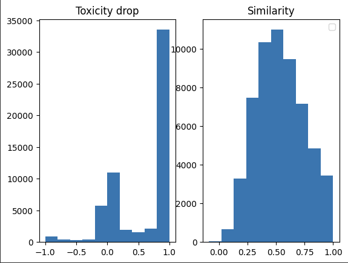
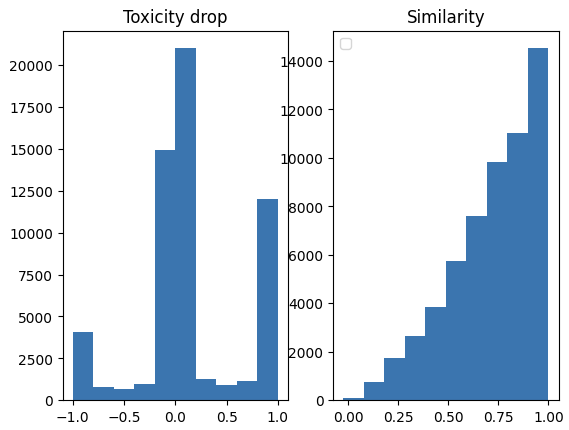

# Initial idea - word translation
First approach for making the baseline was to extract parallel words dataset from the parallel sentences corpora and learn the mapping between "toxic english" and "non-toxic english"
Having such corpora, it would be possible to learn a linear projection (preferably orthogonal) that would map "toxic" words embeddings to their "non-toxic" analogs
Difference between this approach and simple dictionary-based approach is that the mapping between words is learned in the hidden space with MSE loss and pairs like (A, B1) and (A, B2) are handled

The original approach for similar languages translation was described by T. Mikolov, Q. Le and I. Sutskever in https://arxiv.org/pdf/1309.4168.pdf

The initial hypothesis was that the parallel sentences dataset contains enough pairs where a few (or just one) words are changed to detoxify the entire sentence
For such extraction, I filtered the source and target sentences by BLEU score between them and added the pairs of unequal words to the dataset
This approach is quite naive and is probably suboptimal, but for the baseline I did not mean to construct a highly complex solution

As a result, the quality of the translations was low (most likely due to the low quality of parallel words dataset): words translated to themselves or synonyms with little sign of detoxification

The next approach I tried as a baseline was training RNN encoder-decoder model for Seq2Seq task

> all models described below were trained on Kaggle with P100 GPU

# Baseline: RNN encoder-decoder
The baseline model is 3-layer GRU-encoder and 3-layer GRU-decoder with `hidden_size = embedding_size = 200`

To speed up the convergence, I:
1. Initialized the embeddings layer with pre-trained `glove-twitter-200` vectors
2. Tied the embeddings weight matrix to the output vocabulary projection matrix

The model was trained for 10 epochs. The best(final) BLEU reached on the validation set was 5.347, the training took 5 hours and 47 minutes to complete.

### Test set evaluation
During test set inference, nucleus sampling with p=0.8 was used

Toxicity drop mean±std was 0.5983409±0.48755735, which is a quite good result, however the similarity mean±std was 0.53899795±0.21021967, so the model has failed to capture all the meaning of source sentences.

# Hypothesis 1: LoRA for T5 fine-tuning
A logical evolution of the baseline model would be to replace GRU with LSTM and then move to using Attention. 
However, training Attention-based models from scratch is quite costly and long, so one can use parameter-efficient fine-tuning (PEFT) on pre-trained Seq2Seq model
For this, I have chosen T5-small and for the PEFT method I have chosen LoRA with rank=8 and alpha=32

The model was trained for 5 epochs with batch size = 32 and gradient accumulation steps set to 4
The best(final) BLEU reached on the validation set was 24.684, the training took 2 hours and 37 minutes to complete.

### Test set evaluation
During test set inference, nucleus sampling with p=0.8 was used

Toxicity drop mean±std was 0.28107294±0.49237716, and similarity mean±std was 0.681677±0.24484771. The model did not manage to fully detoxify all the sentences, yet it preserved a lot more semantics from the source sentence

# Hypothesis 2: Prefix-Tuning for T5
Another PEFT method I tried for conditional generation was Prefix-Tuning with 8 virtual tokens (base model is still T5-small)

The model was trained for 5 epochs with batch size = 32 and gradient accumulation steps set to 4
The best(final) BLEU reached on the validation set was 24.684, the training took 3 hours and 58 minutes to complete.

### Test set evaluation
During test set inference, nucleus sampling with p=0.8 was used

Toxicity drop mean±std was 0.14439557±0.51733994, and similarity mean±std was 0.7216041±0.21724373. 
Probably the model has learned to repeat the inputs sequence with slight modifications. Overall, the test set translations are worse than T5-LoRA

# Conclusion

Model which provides the best tradeoff between similarity (meaning preservation) and toxicity drop (politeness) is T5+LoRA

It is also worth noting that from the training and validation losses plots (can be found in the `notebooks`) it is clear that models did not reach full convergence, so a promising improvement option would be to train a larger (T5-large ' er) model for longer time (till plateau on validation)