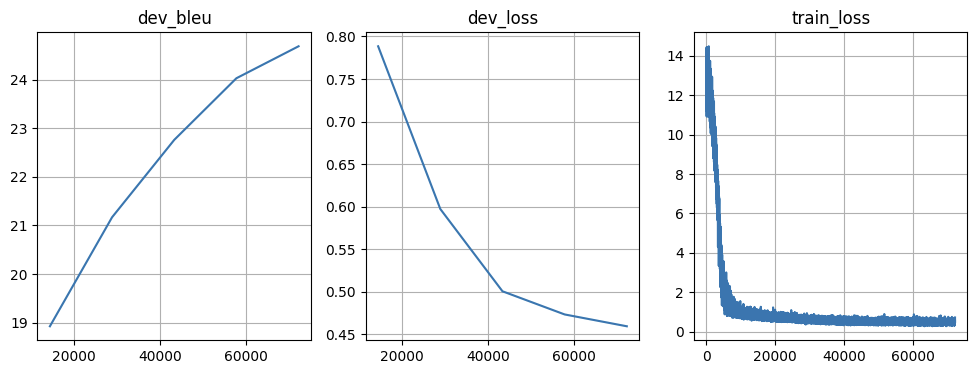
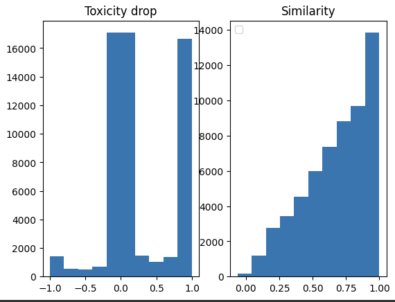

# Introduction

The repository contains solutions to the text detoxification task based primarily on the dataset and definition of text detoxification from [Text Detoxification using Large Pre-trained Neural Models](https://aclanthology.org/2021.emnlp-main.629) (Dale et al., EMNLP 2021).

The definition by Date et al. goes as follows:

    A text detoxification model is a function
    α : S × S × D → D that, given a source style ${s}^{src}$, a target style ${s}^{tg}$, and an input text ${d}^{src}$, produces an output text ${d}^{tg}$ such that:

    • The style of the text changes from the
    source style ${s}^{src}$ to the target style ${s}^{tg}$: $σ({d}^{src}) \ne σ({d}^{tg})$ , $σ({d}^{tg}) = {s}^{tg} $;

    • The content of the source text is saved in the
    target text as much as required for the task:
    δ(${d}^{src}$, ${d}^{tg}$) ≥ $t^δ$;

    • The fluency of the target text achieves the required level: ψ(${d}^{src}$) ≥ $t^ψ$,
    where $t^δ$ and $t^ψ$ are the error tolerance threshold
    values for the content preservation (δ) and fluency
    (ψ) functions

Seq2Seq language modeling could be a solution for such a task (and this task does indeed require ML since understanding deep semantics and editing this semantics is a hard task for autonomization)

# Data analysis

The scatterplot of (toxic sentences measurements, toxicity drop) has a centrality around 
x = y line, which indicates that the overall quality of the dataset is good and lower toxicity sentences tend to remove almost all toxicity from the high tox sentence.

Also, neither similarity between sentences nor length difference seemed to influence the distribution of the toxicity drop.

# Model specification and training

The model used to solve the task in conditional seq2seq generation was pretrained T5-small with frozen weights re-parametrized with LoRA (rank=8 and alpha=32)

The model was trained for 5 epochs with batch size = 32 and gradient accumulation steps set to 4. Learning rate was set to `1e-5`, optimizer - Adam with cosine scheduler
The best(final) BLEU reached on the validation set was 24.684, the training took 2 hours and 37 minutes to complete.

# Evaluation methods

For measuring toxicity drop (more precisely, for measuring the toxicity of a sentence) I have taken the model mentioned in the dataset's [paper](https://aclanthology.org/2021.emnlp-main.629) (Dale et al., EMNLP 2021).
For measuring similarity, `sentence-transformers/all-mpnet-base-v2` has shown the highest (among tried models) correlation with the similarity estimates in the original dataset

During training only BLEU is calculated: this is done mainly because evaluating the validation set predictions was costly in time (approximately the same as one training epoch)

# Results
## Test set evaluation
During test set inference, nucleus sampling with p=0.8 was used

Toxicity drop mean±std was 0.28107294±0.49237716, and similarity mean±std was 0.681677±0.24484771. The model did not manage to fully detoxify all the sentences, yet it preserved a lot more semantics from the source sentence
